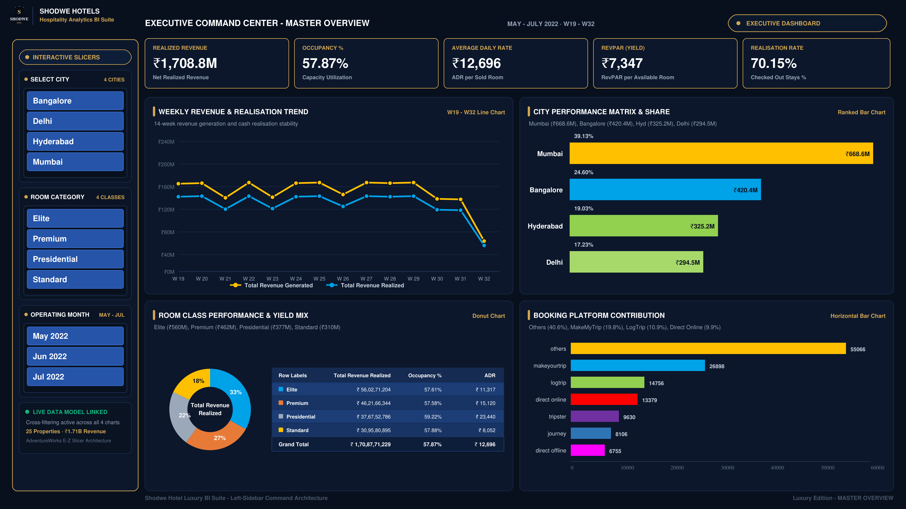
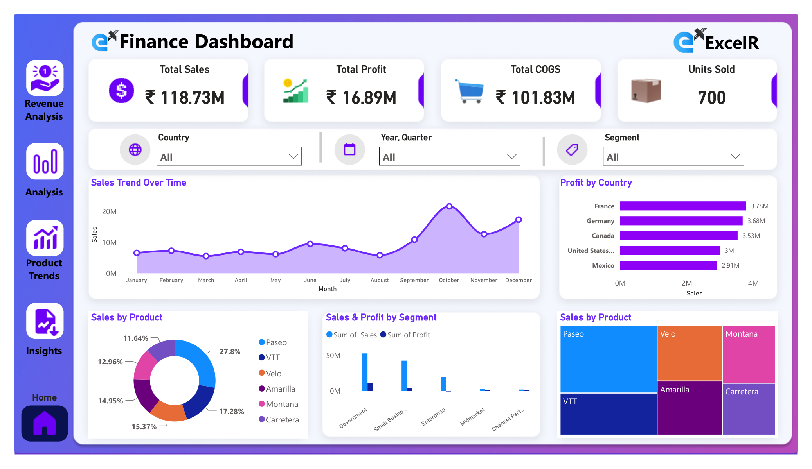
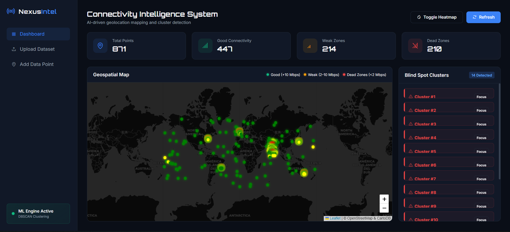
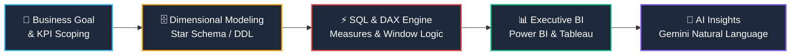
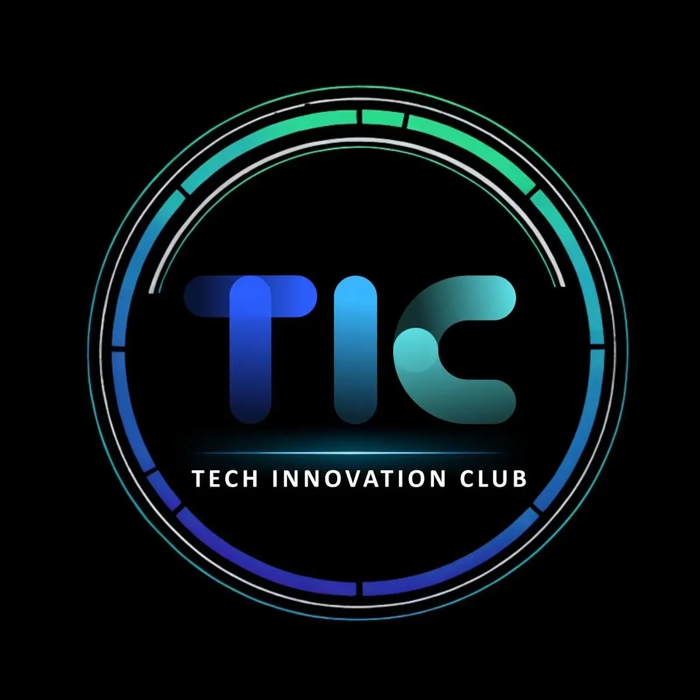

  <table>
    <tr>
      <td align="center" valign="middle" width="160">
        
      </td>
      <td valign="middle" align="left" style="padding-left: 20px;">
        <h1>Hi, I'm Manas Deshmukh </h1>
        
         
        📍 <b>Pune, India</b> • 💼 <b>Ex-IUCAA Project Engineer</b> • 🏛️ <b>President @ TIC Club</b> • 🚀 <b style="color: #10B981;">Actively Seeking Full-Time Roles</b>
      </td>
    </tr>
  </table>

   

  
  
  
  
  

    

  <table>
    <tr>
      <td align="center">
        <i>"I transform raw, complex transactional data into executive business intelligence dashboards, dimensional models, and AI-powered decision support systems."</i>
      </td>
    </tr>
  </table>

---

### 👤 Executive Summary

Data Analyst & Business Intelligence Specialist with a strong foundation in **SQL**, **Power BI**, **DAX**, **Tableau**, and **Python**, alongside working proficiency in **Node.js** and **Express** for data services and backend APIs. Experienced in building enterprise-grade data models (Star Schema / Snowflake), computing critical business KPIs (Revenue, ADR, RevPAR, Churn, Profit Margins), and delivering actionable insights to executive stakeholders.

Having successfully completed all tenure milestones and 3 enterprise application projects as a **Former Project Student at IUCAA** *(Inter-University Centre for Astronomy and Astrophysics)*, architecting secure, database-driven systems and approval workflows. Currently **actively seeking full-time Data Analyst & Business Intelligence roles** (Open to Remote & Relocation).

---

### 🛠️ Core Competencies & Tech Stack

<table>
  <tr>
    <td width="25%" valign="top"><b>📊 Business Intelligence & Analytics</b></td>
    <td width="75%">
      
      
      
      
      
      
       
      KPI Design • Cohort Analysis • Trend & Forecasting • Executive Storytelling • Revenue Analytics
    </td>
  </tr>
  <tr>
    <td width="25%" valign="top"><b>🗄️ Databases & Query Engines</b></td>
    <td width="75%">
      
      
      
       
      Window Functions (DENSE_RANK, LEAD/LAG) • CTEs • Views • Query Optimization • Indexing • Schema Architecture
    </td>
  </tr>
  <tr>
    <td width="25%" valign="top"><b>🐍 Programming & Data Science</b></td>
    <td width="75%">
      
      
      
      
      
       
      Exploratory Data Analysis (EDA) • Statistical Significance • Data Cleaning • Anomaly Detection
    </td>
  </tr>
  <tr>
    <td width="25%" valign="top"><b>🤖 AI & Intelligent Systems</b></td>
    <td width="75%">
      
      
      
      
       
      AI-Assisted Business Intelligence • Grounded Q&A Systems • Text-to-Insights • Risk Detection
    </td>
  </tr>
  <tr>
    <td width="25%" valign="top"><b>⚙️ Engineering & Backend</b></td>
    <td width="75%">
      
      
      
      
      
      
      
       
      RESTful APIs • API Gateways • Docker Compose • Microservices Architecture • Relational DB Pools
    </td>
  </tr>
</table>

---

### 🚀 Visual Flagship Project Portfolio

#### 🥇 Tier 1: Business Intelligence & Data Analytics

<table>
  <tr>
    <td width="50%" valign="top">
      
      <h3>🏨 Shodwe Hospitality BI & Revenue Analytics</h3>
      

        
        
        
        
      

      
Enterprise executive analytics platform evaluating <b>₹1.71 Billion in revenue</b> across 134K+ bookings in 4 metro cities. Diagnoses cancellation leakage, weekend yield pricing, and room category ADR.

      

        
<b>🔍 Click to View Architecture & Key Insights</b>

        <ul>
          <li><b>Star-Schema Architecture:</b> Fact bookings joined to <code>dim_hotels</code>, <code>dim_rooms</code>, and <code>dim_date</code>.</li>
          <li><b>Core Metrics:</b> RevPAR (₹7,340), ADR (₹12,700), Realisation % (70.1%), Occupancy % (57.8%).</li>
          <li><b>Strategic Recommendation:</b> Identified ₹45M+ revenue opportunity via dynamic weekend rate multipliers.</li>
          <li><b>Deliverables:</b> Production <code>FINAL.pbix</code>, Tableau workbook, Excel financial model, and 4 SQL scripts.</li>
        </ul>
      

       
      

        <a href="https://github.com/Manas51240/Shodwe-Hotel-Analytics"><b>👉 View Full Case Study, Data & Code</b></a>
      

    </td>
    <td width="50%" valign="top">
      
      <h3>🚴 AdventureWorks Business Intelligence & SQL Analytics</h3>
      

        
        
        
        
      

      
End-to-end relational database analytics answering 14 core business inquiries across <b>60,398 sales transactions</b> with multi-tier dashboards and window rankings.

      

        
<b>🔍 Click to View SQL Highlights & Architecture</b>

        <ul>
          <li><b>Advanced SQL:</b> CTE multi-table aggregations, <code>DENSE_RANK()</code> customer ranking, and 9 temporal attributes.</li>
          <li><b>Multi-Tool Deliverables:</b> Interactive Tableau analytical dashboard, production Power BI data model, and executive PDF dossier.</li>
          <li><b>Strategic Analysis:</b> YoY revenue growth trends, monthly profit margin variance, and quarterly sales vs cost scorecards.</li>
        </ul>
      

       
      

        <a href="https://github.com/Manas51240/AdventureWorks-SQL-Analytics"><b>👉 View Full Case Study, Tableau & SQL</b></a>
      

    </td>
  </tr>
  <tr>
    <td width="50%" valign="top">
      
      <h3>📈 Commercial Sales Performance BI</h3>
      

        
        
        
      

      
Production-grade sales intelligence dashboard tracking regional revenue concentration, product profitability, dynamic DAX measures, and historical growth velocity.

      

        <a href="https://github.com/Manas51240/Sales-Dashboard-PowerBI"><b>👉 View Dashboard & Repository</b></a>
      

    </td>
    <td width="50%" valign="top">
      
      <h3>📡 Telecom Blind-Spot Intelligence Platform</h3>
      

        
        
        
      

      
Geospatial telecommunication analytics engine detecting signal dropouts, latency anomalies, and speed bottlenecks (< Mbps) to automate cell-tower placement recommendations.

      

        <i>Spatial Data Analytics & AI Remediation</i>
      

    </td>
  </tr>
</table>

---

#### 🥈 Tier 2: AI-Powered Analytics & Decision Systems

<table>
  <tr>
    <td width="50%" valign="top">
      <h3>🏟️ SmartVenue-AI — Predictive Venue & Crowd Intelligence</h3>
      
<b>FastAPI • React • TypeScript • Gemini AI • Leaflet Mapping</b>

      
Next-generation smart venue analytics engine combining real-time crowd density heatmaps, predictive queue wait times, and a Gemini-powered conversational assistant for operational event decisions.

      
<a href="https://github.com/Manas51240/SmartVenue-AI"><b>Explore SmartVenue-AI Repository →</b></a>

    </td>
    <td width="50%" valign="top">
      <h3>⚖️ NyayaLens — Grounded AI Legal Document Platform</h3>
      

        
        
        
        
      

      
Production GenAI legal understanding platform translating complex contracts into structured review priorities, 10-dimension <b>Legal Risk Radar</b>, contract comparison, and attorney consultation briefs with zero data retention.

      

        <a href="https://nyayalens-eight.vercel.app/"><b>🌐 Open Live Platform</b></a> • 
        <a href="https://github.com/Manas51240/NyayaLens"><b>💻 View Source Code →</b></a>
      

    </td>
  </tr>
</table>

---

#### 🥉 Tier 3: Specialized Remote Sensing & Institutional Enterprise Systems

<table>
  <tr>
    <td width="50%" valign="top">
      <h3>🛰️ AkashDrishti — Satellite Remote Sensing Platform</h3>
      
<b>Python • Sentinel-2 Space Imagery • NumPy • Flask • Firebase</b>

      
Satellite environmental change detection engine integrated with the Copernicus Data Space Ecosystem (CDSE):

      <ul>
        <li>Automated calculation of <b>NDVI</b> (Vegetation), <b>NDWI</b> (Water Bodies), and <b>NDBI</b> (Built-up Indices).</li>
        <li>Multi-temporal image comparison with cloud masking and optimized parallel pixel computation.</li>
        <li>Interactive geospatial visualization tracking urban sprawl and ecological shifts over time.</li>
      </ul>
      
<a href="https://github.com/Manas51240/AkashDrishti"><b>Explore AkashDrishti Repository →</b></a>

    </td>
    <td width="50%" valign="top">
      <h3>🏢 IUCAA Enterprise Platforms (Travel Claim & Workshop Governance)</h3>
      
<b>Node.js • Express • MySQL 8.0 • React (TypeScript) • Docker • Nginx</b>

      
Production enterprise platforms designed for the <b>Inter-University Centre for Astronomy and Astrophysics (IUCAA), Pune</b>:

      <ul>
        <li><b>Travel Claim Digitization Portal:</b> 3-Reviewer sequential evaluation pipeline (Travel &rarr; Guest House &rarr; Finance) automating reimbursement calculations, TA/DA audits, and official PDF dossier compilation via <code>pdfmake</code>.</li>
        <li><b>Workshop Proposal & Governance Platform:</b> Academic symposium governance engine with a 7-step submission wizard, smart faculty directory verification, automated financial auditing, and committee voting workflows.</li>
        <li>Containerized microservices orchestration via Docker Compose, Nginx reverse proxy, and JWT/Bcrypt authentication.</li>
      </ul>
      
<i>🔒 Institutional Enterprise Platforms (On-Premise / Source Code Proprietary to IUCAA)</i>

    </td>
  </tr>
</table>

---

### 📐 End-to-End Analytics Workflow

1. **Understand Business Context:** Define specific questions (*What drives cancellation? Which channels have the highest ADR?*).
2. **Robust Dimensional Modeling:** Design Star Schemas with clean surrogate keys, conformed dimensions, and audit trails.
3. **Optimized Calculations:** Build accurate, high-performance DAX measures and SQL window functions rather than ad-hoc calculations.
4. **Insights Over Aesthetics:** Highlight the "So What?" — translating charts into operational strategies, revenue recovery, and AI-assisted anomaly detection.

---

### 📈 Solutions Delivered & Technical Footprint

  <table>
    <tr>
      <td align="center" width="25%">
        <h3>📊 200,000+</h3>
        <b>Transactional Records</b> Multi-Source Relational & Fact Marts
      </td>
      <td align="center" width="25%">
        <h3>🏨 ₹1.71B+</h3>
        <b>Revenue Evaluated</b> ADR, RevPAR & Yield Modeling
      </td>
      <td align="center" width="25%">
        <h3>🏢 3</h3>
        <b>Delivered Portals</b> Enterprise Platforms @ IUCAA
      </td>
      <td align="center" width="25%">
        <h3>🤖 4</h3>
        <b>AI Decision Engines</b> Gemini, Spatial Clustering & Vision
      </td>
    </tr>
    <tr>
      <td align="center">
        <h3>📈 10+</h3>
        <b>Production Dashboards</b> Power BI, Tableau & Excel Financials
      </td>
      <td align="center">
        <h3>⚡ 14+</h3>
        <b>Enterprise SQL Solutions</b> CTEs, Window Rankings & YoY Audits
      </td>
      <td align="center">
        <h3>🗄️ 100%</h3>
        <b>Star-Schema Integrity</b> Conformed Dims & Audit Suites
      </td>
      <td align="center">
        <h3>🛰️ 3</h3>
        <b>Remote Sensing Indices</b> NDVI, NDWI & NDBI Pipeline
      </td>
    </tr>
  </table>

 

### ⚡ Analytics & Technical Proficiency

  <table>
    <tr>
      <td width="50%">
        <b>📊 Business Intelligence & Visualization</b> 
        <code>Power BI</code> <code>DAX</code> <code>Tableau</code> <code>Excel Pivot/VBA</code> <code>KPI Modeling</code> 
        
      </td>
      <td width="50%">
        <b>🗄️ Relational Databases & SQL</b> 
        <code>Complex SQL</code> <code>MySQL</code> <code>Window Ranking</code> <code>Oracle DB Admin</code> 
        
      </td>
    </tr>
    <tr>
      <td width="50%">
        <b>🐍 Programming & Data Wrangling</b> 
        <code>Python</code> <code>Pandas</code> <code>NumPy</code> <code>Scikit-Learn</code> <code>EDA</code> 
        
      </td>
      <td width="50%">
        <b>🤖 AI-Driven Solutions & Backend</b> 
        <code>Google Gemini API</code> <code>FastAPI</code> <code>Node.js</code> <code>Docker</code> 
        
      </td>
    </tr>
  </table>

---

### 📚 Peer-Reviewed Research & Academic Publications

<table>
  <tr>
    <td width="50%" valign="top">
      <h4>📄 Legacy System Modernization Framework</h4>
      
<b>International Journal of Innovative Research in Science, Engineering and Technology (IJIRSET)</b>

      
<i>Vol. 14, Issue 11 • DOI: <code>10.15680/IJIRSET.2025.1411082</code> • e-ISSN: 2319-8753</i>

      
Investigates architectural frameworks for migrating legacy Oracle 10g Forms & Reports to modernized database backends, validating automated schema workflows, transactional integrity, and reporting engines under research faculty guidance.

    </td>
    <td width="50%" valign="top">
      <h4>📄 Enterprise Oracle Forms & Reports Migration to Oracle 12c</h4>
      
<b>International Journal of Innovative Research in Science, Engineering and Technology (IJIRSET)</b>

      
<i>Vol. 15, Issue 5 • DOI: <code>10.15680/IJIRSET.2026.1505172</code> • e-ISSN: 2319-8753</i>

      
Delivers a practical enterprise modernization framework addressing recompilation pipelines, middleware configuration (Oracle WebLogic), and zero-loss database schema validation for high-availability systems.

    </td>
  </tr>
</table>

---

### 🏛️ Executive Leadership & Institutional Web Architecture

<table>
  <tr>
    <td width="160" align="center" valign="middle">
      
        
      <b>Official Emblem</b>
    </td>
    <td valign="middle" style="padding-left: 20px;">
      <h3>👑 President & Lead Web Architect — Technology Innovation Club (TIC)</h3>
      

        
        
        
        
      

      
Headed the executive committee of the university's premier technical body, directing event operations, hackathons, and technical symposiums while architecting the club's official web portal from scratch.

      <ul>
        <li><b>Engineered & Deployed Official Portal:</b> Built the high-performance multi-page portal (<a href="https://tic-official.netlify.app/"><code>tic-official.netlify.app</code></a>) utilizing vanilla HTML5, glassmorphism CSS3, and ES6+ JavaScript, eliminating paper operations for 500+ participants.</li>
        <li><b>Digital Certificate Verification Engine:</b> Designed a query-parameter driven verification engine (<a href="https://tic-official.netlify.app/verify.html"><code>/verify.html?id=TIC-2026-0001</code></a>) with animated scanner feedback to validate student credentials and awards.</li>
        <li><b>Executive Mentorship & Hackathon Management:</b> Mentored <b>150+ student engineers</b> across collegiate hackathons, robotics exhibitions, debates, and annual National Science Day competitions.</li>
        <li><b>Data Privacy & Security Architecture:</b> Implemented a clean separation of concerns, isolating public presentation components while safeguarding institutional student registration ledgers and private webhook credentials.</li>
      </ul>
      

        <a href="https://tic-official.netlify.app/"><b>🌐 Visit Live TIC Website</b></a> • 
        <a href="https://tic-official.netlify.app/verify.html"><b>🛡️ Try Certificate Scanner</b></a> • 
        <a href="https://github.com/Manas51240/TIC-Club-Official-Portal"><b>💻 Explore Portal Repository →</b></a>
      

    </td>
  </tr>
</table>

---

### 📬 Let's Connect & Collaborate

- 💼 **LinkedIn:** [linkedin.com/in/manas-deshmukh-493a35218](https://www.linkedin.com/in/manas-deshmukh-493a35218)
- 🌐 **Portfolio Website:** [manas-deshmukh.vercel.app](https://manas-deshmukh.vercel.app/)
- 📧 **Direct Email:** [manasdeshmukh51240@gmail.com](mailto:manasdeshmukh51240@gmail.com)
- 📍 **Location:** Pune, India (Open to Relocation & Remote Roles)

 

  Designed & engineered with precision by Manas Deshmukh • Data Analyst & Business Intelligence Specialist

